# Agent Comms 流程機制全解

> 每一個 bridge 行程都是網格中的一個 peer。沒有 daemon、沒有檔案輪詢、沒有中央路由器。
> 這份文件用**一棟沒有物業公司的公寓**當作貫穿全文的比喻，配合 17 張流程圖，
> 按真實執行順序拆解 `src/core` 與 `src/bridges`：身分怎麼生成、peer 怎麼互相認識、
> 一則訊息從 `send` 到抵達對方 LLM 上下文之間究竟經過哪些函式。

| 協調埠 | 框架 | 傳輸 | 身分 | 陳舊探測 | 離線清除 |
|---|---|---|---|---|---|
| `19876` | newline-delimited JSON | TCP / TLS / WebSocket | ECDSA P-256 憑證指紋 | 5 秒 | 30 分鐘 |

---

## 00 · 整棟公寓比喻與整體構造

想像一棟公寓，裡面住著小美（Claude Code）、阿宏（pi）、大熊（Codex）三位鄰居。他們各自關在自己的房間工作，聽不見隔壁在做什麼。

這棟樓**沒有請管理員**。於是他們約好一件事：*誰第一個到，誰就先坐櫃檯*。坐櫃檯的人只做一件事——幫新來的人介紹「這棟樓現在有誰、他家門牌幾號」。介紹完，大家就直接敲彼此的門講話，不必再經過櫃檯。

這棟樓的一切規則，都是從這個約定長出來的。

| 公寓裡的事物 | 系統中的角色 | 程式碼 |
|---|---|---|
| 一位住戶 | 一個 bridge 行程＝一個 peer | `MeshStore` 實例 |
| 坐櫃檯的那位住戶 | 協調者（第一個綁到 19876 的人） | `becomeCoordinator()` |
| 大門電鈴（固定位置） | 眾所周知的協調埠 19876 | `DEFAULT_COORDINATOR_PORT` |
| 自家門牌號碼 | 由 OS 指派的資料埠 | `dataPort` |
| 本人印章（無法偽造） | 自簽憑證的 SHA-256 指紋 | `generateIdentity()` |
| 公佈欄／社團 | 房間 room | `rooms` |
| 當面私下講一句話 | DM | `sendDm()` |
| 門口的信箱 | 投遞佇列／pending 檔 | `deliveryQueues` |
| 郵差按門鈴叫醒你 | hooks 抽取 + exit 2 喚醒 | `drain.sh` |
| 櫃檯定時巡邏敲門 | 5 秒 PID 探測 | `probeStaleAgents()` |
| 與隔壁棟拉一條專線 | 聯邦鏈路 | `FederationManager` |

### 三層構造

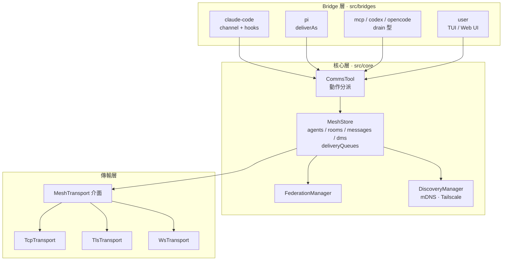
```mermaid
graph TB
    subgraph BR["Bridge 層 · src/bridges"]
      B1["claude-code<br/>channel + hooks"]
      B2["pi<br/>deliverAs"]
      B3["mcp / codex / opencode<br/>drain 型"]
      B4["user<br/>TUI / Web UI"]
    end
    subgraph CO["核心層 · src/core"]
      T["CommsTool<br/>動作分派"]
      M["MeshStore<br/>agents / rooms / messages / dms<br/>deliveryQueues"]
      F["FederationManager"]
      D["DiscoveryManager<br/>mDNS · Tailscale"]
    end
    subgraph TR["傳輸層"]
      X["MeshTransport 介面"]
      X1["TcpTransport"]
      X2["TlsTransport"]
      X3["WsTransport"]
    end
    B1 --> T
    B2 --> T
    B3 --> T
    B4 --> T
    T --> M
    M --> F
    M --> D
    M --> X
    X --> X1
    X --> X2
    X --> X3
```

*圖 0a — MeshStore 對傳輸只依賴 `MeshTransport` 介面；換成 TLS 時它完全無感。*

MeshStore 是唯一持有狀態的地方，而且全部在記憶體：`agents`、`rooms`、`messages`、`dms`、`deliveryQueues` 五個 Map。行程結束，狀態就消失——這正是身分不需要落地保存的理由。

### 先看全景：一句話從送出到被聽見

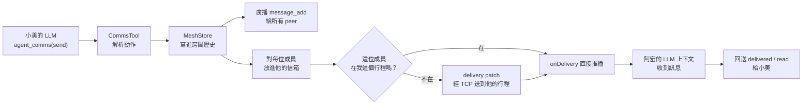
```mermaid
flowchart LR
    A["小美的 LLM<br/>agent_comms(send)"] --> B["CommsTool<br/>解析動作"]
    B --> C["MeshStore<br/>寫進房間歷史"]
    C --> D["廣播 message_add<br/>給所有 peer"]
    C --> E["對每位成員<br/>放進他的信箱"]
    E --> F{"這位成員<br/>在我這個行程嗎？"}
    F -- 在 --> G["onDelivery 直接推播"]
    F -- 不在 --> H["delivery patch<br/>經 TCP 送到他的行程"]
    H --> G
    G --> I["阿宏的 LLM 上下文<br/>收到訊息"]
    I --> J["回送 delivered / read<br/>給小美"]
```

*圖 0b — 後面每一節，都是在放大這條線上的其中一段。*

---

## 01 · 身分生成

> **生活比喻**
> 一般網站的憑證像**政府核發的身分證**：你得先相信政府（CA），才能相信這張證。
> 這裡用的是另一招——每位住戶自己刻一枚**印章**，第一次見面時交換印模。之後只要蓋出來的印跟第一次留的一模一樣，就是本人。不需要政府，只需要「第一次記住」。
> 更妙的是：*這枚印章的紋路本身就是他的名字*。名字無法冒用，因為冒名等於要偽造整枚印章。

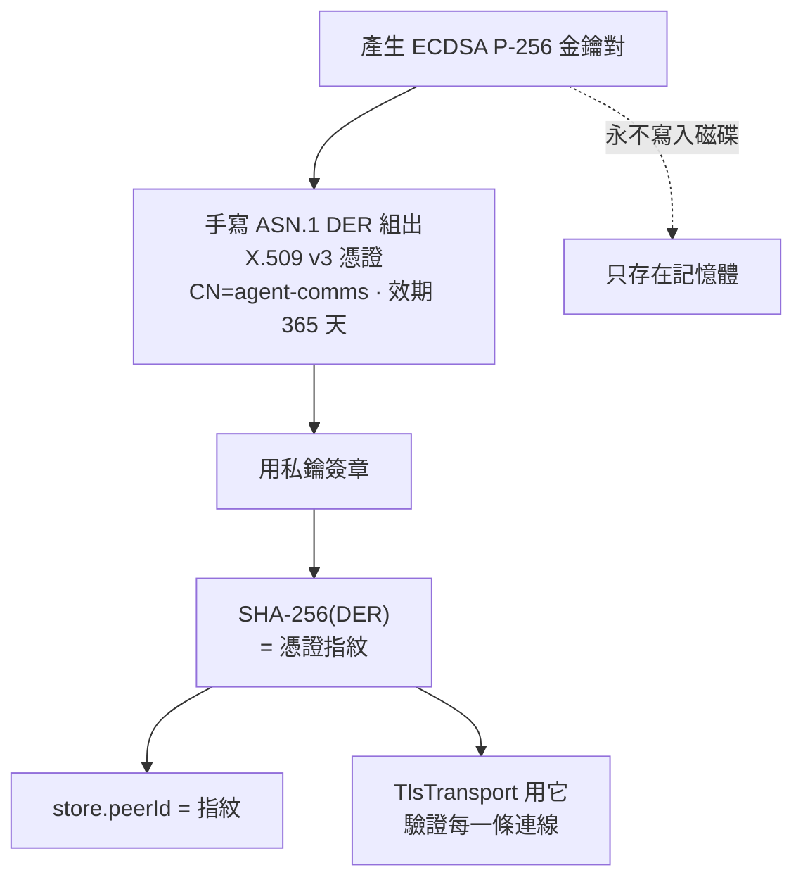
```mermaid
flowchart TB
    A["產生 ECDSA P-256 金鑰對"] --> B["手寫 ASN.1 DER 組出<br/>X.509 v3 憑證<br/>CN=agent-comms · 效期 365 天"]
    B --> C["用私鑰簽章"]
    C --> D["SHA-256(DER)<br/>= 憑證指紋"]
    D --> E["store.peerId = 指紋"]
    D --> F["TlsTransport 用它<br/>驗證每一條連線"]
    A -.->|"永不寫入磁碟"| G["只存在記憶體"]
```

*圖 1a — 身分即指紋：`identity.ts` 的完整流程。*

`generateIdentity()`（`src/core/identity.ts`）在啟動時做四件事：產生 ECDSA P-256 金鑰對、用手寫的 ASN.1 DER 編碼組出一張 X.509 v3 自簽憑證（CN=`agent-comms`、SAN 含 `DNS:localhost` 與 `IP:127.0.0.1`、CA:FALSE、效期 365 天）、以私鑰簽章、最後算出 DER 的 SHA-256 指紋。

```typescript
const identity = generateIdentity();
const store = new MeshStore();
store.peerId = identity.fingerprint;               // 指紋即 peer ID
store.setTransport(new TlsTransport(store.events, identity));
```

這是 Syncthing 的信任模型：憑證釘選（certificate pinning）。金鑰只存在記憶體，永不落磁碟。MeshStore 建構子預設用 `nanoid(8)` 當 peerId、走純 TCP；像 Claude Code bridge 這種要走 TLS 的，就在 `init()` 前把 `peerId` 換成指紋。

---

## 02 · 加入網格

> **生活比喻**
> 你搬進這棟樓，第一件事是**把自家門牌掛上、門打開**（開資料伺服器），然後走到大門按那個固定的電鈴（19876）。
>
> - **有人應門**：太好了，櫃檯已經有人，你就是普通住戶。
> - **沒人應門**：那你自己去坐櫃檯。
> - **櫃檯有人坐著但不吭聲**（前一位住戶已經走了、椅子還被雜物佔著）：你不會一直站著按電鈴，而是聳聳肩自己回房間工作——只是這段時間你聯絡不到任何人。

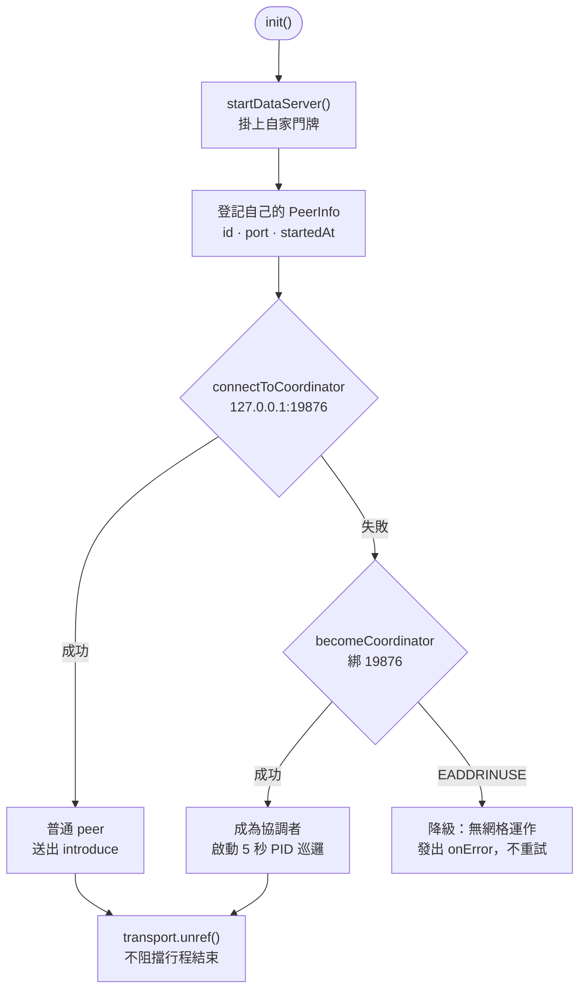
```mermaid
flowchart TB
    S(["init()"]) --> A["startDataServer()<br/>掛上自家門牌"]
    A --> B["登記自己的 PeerInfo<br/>id · port · startedAt"]
    B --> C{"connectToCoordinator<br/>127.0.0.1:19876"}
    C -- 成功 --> D["普通 peer<br/>送出 introduce"]
    C -- 失敗 --> E{"becomeCoordinator<br/>綁 19876"}
    E -- 成功 --> F["成為協調者<br/>啟動 5 秒 PID 巡邏"]
    E -- EADDRINUSE --> G["降級：無網格運作<br/>發出 onError，不重試"]
    D --> H["transport.unref()<br/>不阻擋行程結束"]
    F --> H
```

*圖 2a — 三種結局，只跑一輪。*

1. **`startDataServer()`** — 由 OS 指派一個埠，開始接受其他 peer 的直連資料連線。
2. **登記自己的 PeerInfo** — `{ id, port: dataPort, startedAt }` 寫進本地 `peerInfo`。
3. **`connectToCoordinator(127.0.0.1, 19876)`** — 成功即成為一般 peer，送出 `introduce`。
4. **失敗 → `becomeCoordinator()`** — 綁到眾所周知的埠，並啟動 5 秒陳舊探測（只有協調者跑）。
5. **EADDRINUSE → 降級運作** — 埠被無回應的孤兒行程佔住時，發出 onError 並在「無網格」狀態下繼續，不重試。
6. **`transport.unref()`** — 所有 root handle 解除引用，讓 harness 行程能正常結束，socket 仍可收送。

> ⚠️ **為什麼不重試**
> 對非 TLS 端點做失敗的 `tls.connect` 之後再重試，會踩到 Node.js TLS session cache 的 bug 而凍結 event loop。因此 `init()` 刻意只走一輪「連線 → 否則稱王 → 否則降級」。

---

## 03 · 協調者交握

> **生活比喻**
> 櫃檯不是**總機**，是**迎新志工**。新住戶報到，志工遞給他一份「現住戶名冊」，同時在群組喊一聲「三樓搬來新鄰居了」。接下來小美要找阿宏，是自己走過去敲門——不會、也不需要經過櫃檯轉達。
> 這就是為什麼櫃檯垮了大家還能繼續講話：它從來就不在對話的路徑上。

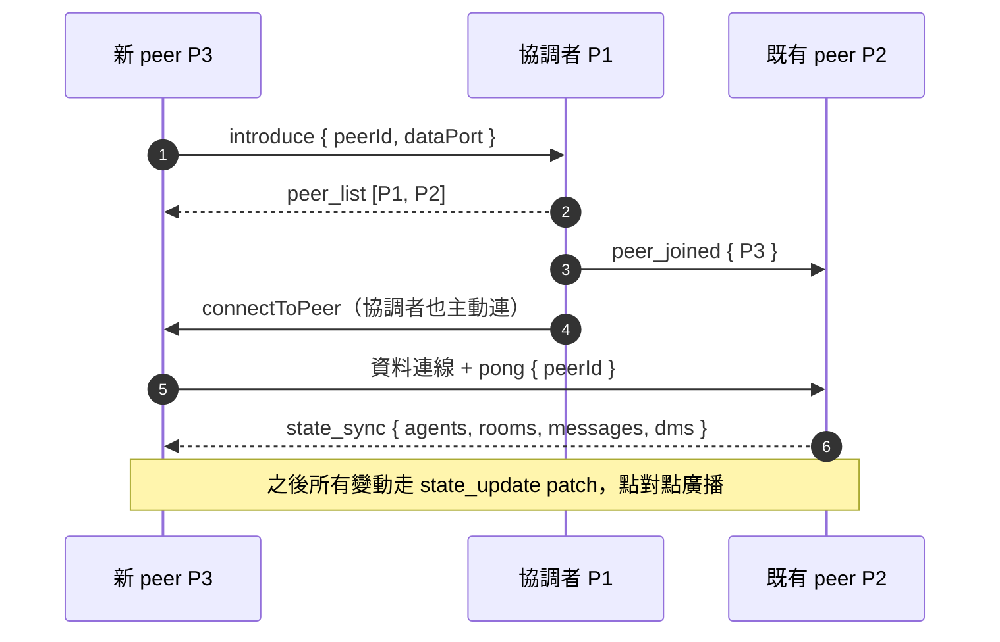
```mermaid
sequenceDiagram
    autonumber
    participant P3 as 新 peer P3
    participant C as 協調者 P1
    participant P2 as 既有 peer P2
    P3->>C: introduce { peerId, dataPort }
    C-->>P3: peer_list [P1, P2]
    C->>P2: peer_joined { P3 }
    C->>P3: connectToPeer（協調者也主動連）
    P3->>P2: 資料連線 + pong { peerId }
    P2-->>P3: state_sync { agents, rooms, messages, dms }
    Note over P2,P3: 之後所有變動走 state_update patch，點對點廣播
```

*圖 3a — `handleIntroduction()` 一次做三件事：回 peer_list、廣播 peer_joined、自己也連上新 peer。*

### 需要核可的連線（跨機）

> **生活比喻**
> 住在同一棟樓的鄰居敲門，直接開；**外面來的陌生人按對講機**，你會先在螢幕上看他是誰、確認他手上那張名片的印章紋路，再決定要不要按下開門鍵。`mesh_accept` 就是那顆開門鍵。

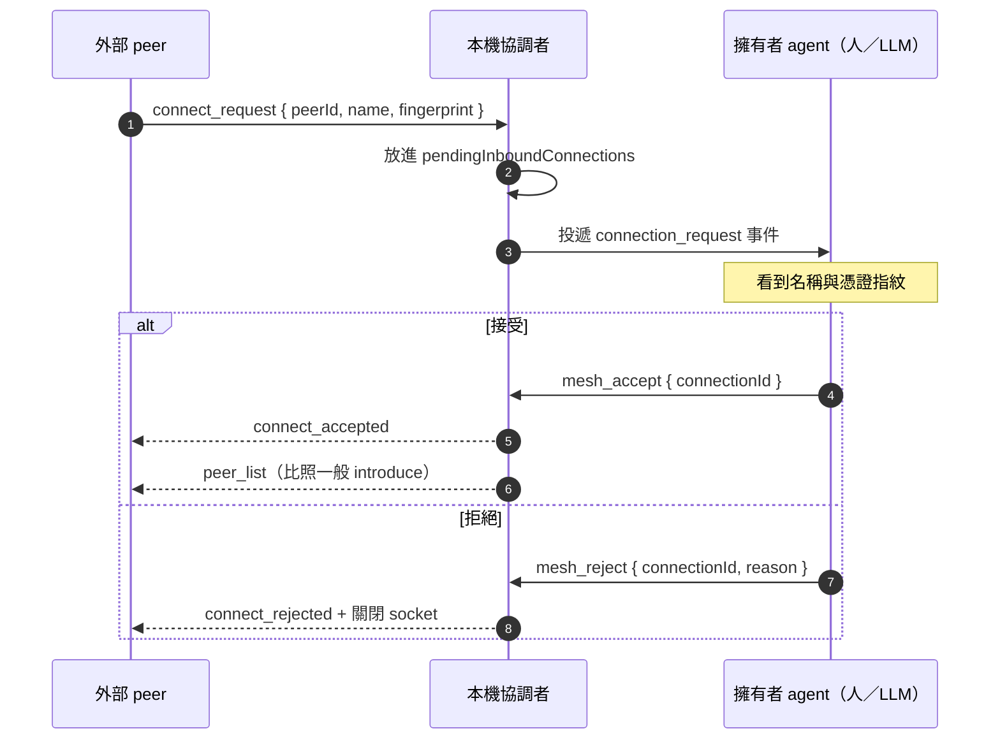
```mermaid
sequenceDiagram
    autonumber
    participant R as 外部 peer
    participant C as 本機協調者
    participant A as 擁有者 agent（人／LLM）
    R->>C: connect_request { peerId, name, fingerprint }
    C->>C: 放進 pendingInboundConnections
    C->>A: 投遞 connection_request 事件
    Note over A: 看到名稱與憑證指紋
    alt 接受
        A->>C: mesh_accept { connectionId }
        C-->>R: connect_accepted
        C-->>R: peer_list（比照一般 introduce）
    else 拒絕
        A->>C: mesh_reject { connectionId, reason }
        C-->>R: connect_rejected + 關閉 socket
    end
```

*圖 3b — 跨機連線的核可流程；本機 peer 不走這條路。*

### 監聽策略與探索

| 機制 | 動作 | 語意 |
|---|---|---|
| listener policy | `mesh_listen` | `full`／`observe`／`rooms-only`／`gateway`——由接受連線的 listener 繼承到每條 `ConnectionHandle` 上。預設的 localhost listener 不可移除。 |
| discovery | `mesh_advertise` / `mesh_discover` | mDNS 與 Tailscale 兩個後端，**完全 opt-in**：沒呼叫 advertise 就不會對外廣播任何東西。 |
| mesh visibility | `mesh_set_visibility` | `discoverable`／`quiet`／`dark`，可依網卡分別設定；轉暗時既有廣告被暫停而非刪除。 |

---

## 04 · 狀態同步

> **生活比喻**
> 新鄰居報到時，你把**整本住戶名冊影印一份**給他（全量）。之後有人搬進搬出，你不會再影印整本，只在群組說「502 換人了」（增量便條）。
> 關鍵細節：他收到影本時，**以自己手上已寫的為準**，只補抄空白的欄位。否則他剛親手寫下的「我叫小美」，會被一份較舊的影本蓋掉。

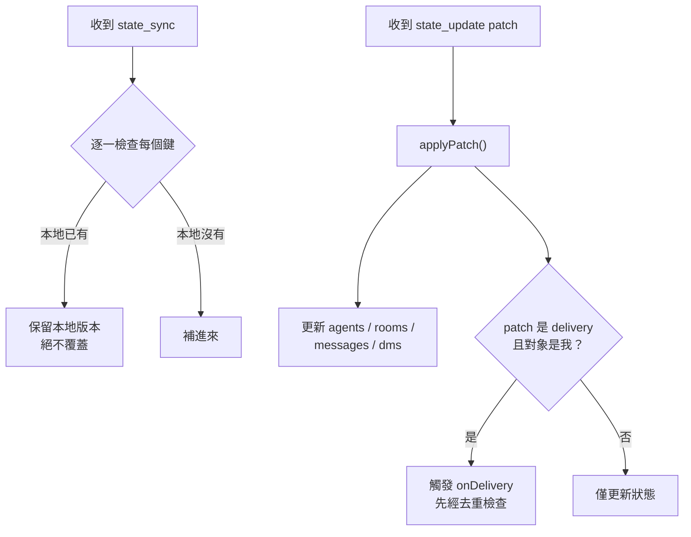
```mermaid
flowchart TB
    A["收到 state_sync"] --> B{"逐一檢查每個鍵"}
    B -->|"本地已有"| C["保留本地版本<br/>絕不覆蓋"]
    B -->|"本地沒有"| D["補進來"]
    E["收到 state_update patch"] --> F["applyPatch()"]
    F --> G["更新 agents / rooms /<br/>messages / dms"]
    F --> H{"patch 是 delivery<br/>且對象是我？"}
    H -- 是 --> I["觸發 onDelivery<br/>先經去重檢查"]
    H -- 否 --> J["僅更新狀態"]
```

*圖 4a — 合併規則與 patch 落地；「本地優先」是唯一避免狀態被洗掉的保證。*

| Patch | 觸發時機 |
|---|---|
| `agent_upsert` | 註冊、更新、加入房間造成 subscribedRooms 變動 |
| `agent_offline` | 優雅關閉、PID 探測判定死亡 |
| `room_upsert` / `room_delete` | 建立、加入、離開、邀請、踢人、銷毀 |
| `message_add` / `dm_add` | 房間訊息與 DM 寫入歷史 |
| `delivery` | 對某 agent 的投遞事件（跨 peer 送到它真正所在的行程） |
| `message_read` | 已讀回條的跨 peer 傳播 |

---

## 05 · 註冊與可見性

> **生活比喻**
> 三種可見性就像社區裡三種住戶：
> - **visible**——名字掛在一樓住戶表上，誰都能來敲門。
> - **hidden**——不上住戶表，但*知道你門牌的人*還是敲得到。
> - **ghost**——查無此人。就算有人硬報你的門牌，系統也只回一句「查無此戶」。

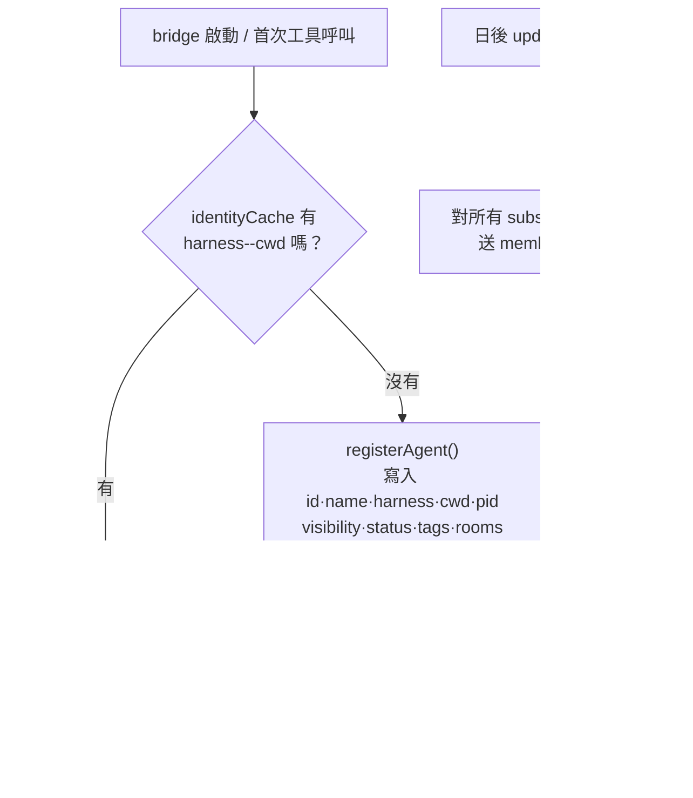
```mermaid
flowchart TB
    A["bridge 啟動 / 首次工具呼叫"] --> B{"identityCache 有<br/>harness--cwd 嗎？"}
    B -- 有 --> C["沿用既有 agentId"]
    B -- 沒有 --> D["registerAgent()<br/>寫入 id·name·harness·cwd·pid<br/>visibility·status·tags·rooms"]
    D --> E["broadcastPatch(agent_upsert)"]
    C --> F["工具可以開始運作"]
    E --> F
    G["日後 update(status)"] --> H["對所有 subscribedRooms<br/>送 member_status"]
```

*圖 5a — `ensureRegistered()`：pid 供後續巡邏使用，cwd 供 Claude Code 信箱命名使用。*

| visibility | list_agents | 可被 DM | 程式碼位置 |
|---|---|---|---|
| `visible` | 是 | 是 | `listAgents()` / `sendDm()` |
| `hidden` | 是（僅 ghost 被過濾） | 是，需已知 ID | 同上 |
| `ghost` | 否（只有自己看得到） | 否，擲 `AGENT_NOT_FOUND` | 同上 |

> ⚠️ **實作與上表不符**
> `MeshStore.listAgents()` 只過濾 `ghost`，`CommsTool.listAgents()` 拿到結果後也不再過濾，
> 輸出還包含 `id / name / harness / status / visibility / cwd / Rooms`。
> 也就是說 **`hidden` 目前在功能上等同 `visible`**，文件宣稱的「不列出、但知道 ID 的人仍可 DM」
> 沒有任何一行實作。修法見 [`todo.md`](../todo.md) #6。

狀態（`active` / `idle` / `busy` / `offline`）每次變動，都會對該 agent 所屬的每個房間送出 `member_status` 事件——涵蓋顯式 `update`、重新註冊、優雅關閉、以及被探測判定死亡四條路徑。

---

## 06 · 房間

> **生活比喻**
> **public** ＝ 一樓的公佈欄，路過就看得到，想貼就貼。
> **private** ＝ 社區讀書會，名字寫在公佈欄上，但要有人邀請才進得去。
> **secret** ＝ 幾個人私下組的小群，沒被拉進去的人根本不知道它存在。

| type | list_rooms | join_room | 讀歷史 |
|---|---|---|---|
| `public` | 列出 | 任何人直接加入 | 任何人 |
| `private` | 列出（名稱可見） | 需在 `invited`、為 owner 或已是 member | 成員 |
| `secret` | 非成員完全看不到 | 同上，需受邀 | 成員 |

### 加入房間時發生的事

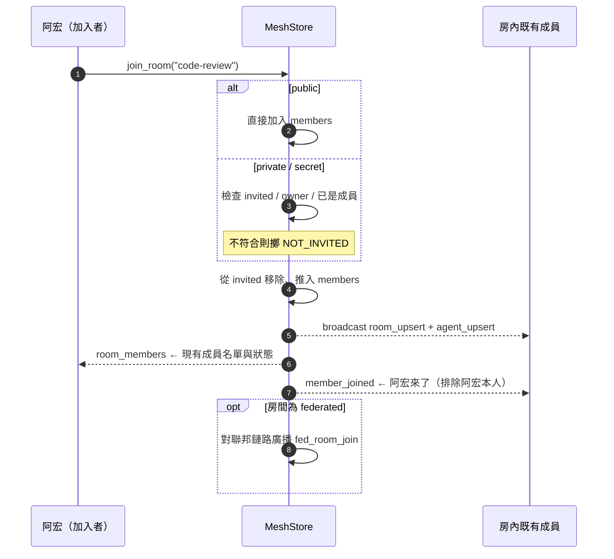
```mermaid
sequenceDiagram
    autonumber
    participant B as 阿宏（加入者）
    participant M as MeshStore
    participant A as 房內既有成員
    B->>M: join_room("code-review")
    alt public
        M->>M: 直接加入 members
    else private / secret
        M->>M: 檢查 invited / owner / 已是成員
        Note over M: 不符合則擲 NOT_INVITED
    end
    M->>M: 從 invited 移除、推入 members
    M-->>A: broadcast room_upsert + agent_upsert
    M-->>B: room_members ← 現有成員名單與狀態
    M-->>A: member_joined ← 阿宏來了（排除阿宏本人）
    opt 房間為 federated
        M->>M: 對聯邦鏈路廣播 fed_room_join
    end
```

*圖 6a — 一次加入，兩個方向的告知：新人知道有誰、舊人知道來了誰。*

離開、邀請、拒絕邀請、踢人、銷毀房間各自對應 `member_left`、`room_invite`、`invite_declined` 等事件，路徑同構。

### 誰擁有房間

`room.owner` 是**建立房間的那個 agent**，跟協調者無關——協調者收到 `room_upsert` patch 的
方式跟其他 peer 一模一樣，沒有優先權也沒有否決權。owner 只管三個動作：

| 動作 | 檢查 | 錯誤 |
|---|---|---|
| `invite` | `room.owner !== inviterId` | `NOT_OWNER` |
| `kick` | `room.owner !== kickerId` | `NOT_OWNER` |
| `destroy_room` | `room.owner !== agentId` | `NOT_OWNER` |

`send`、`join_room`、`read_room`、`leave_room` 都不看 owner，只看成員資格與房型。

> ⚠️ **owner 離開後房間會變成無主**
> 三條離開路徑（`leave_room`、優雅關閉、崩潰）沒有任何一條會更新 `room.owner`。
> `leaveRoom()` 只有「我是 owner 且我是最後一人」才 `destroyRoom()`；owner 離開但房裡
> 還有人時，`invite` / `kick` / `destroy_room` 對所有人永久回傳 `NOT_OWNER`。
> 崩潰的 agent 更是不會被移出 `room.members`。修法見 [`todo.md`](../todo.md) #2、#3。

---

## 07 · 送出訊息

> **生活比喻**
> 小美在公佈欄貼公告，順序是：**先把公告釘上去**（寫進歷史），**再抄一份給每位社員的信箱**（逐一投遞）。她不會把自己那份也投進自己信箱——所以 `readBy` 一開始就含發文者，而投遞迴圈會跳過 `from`。

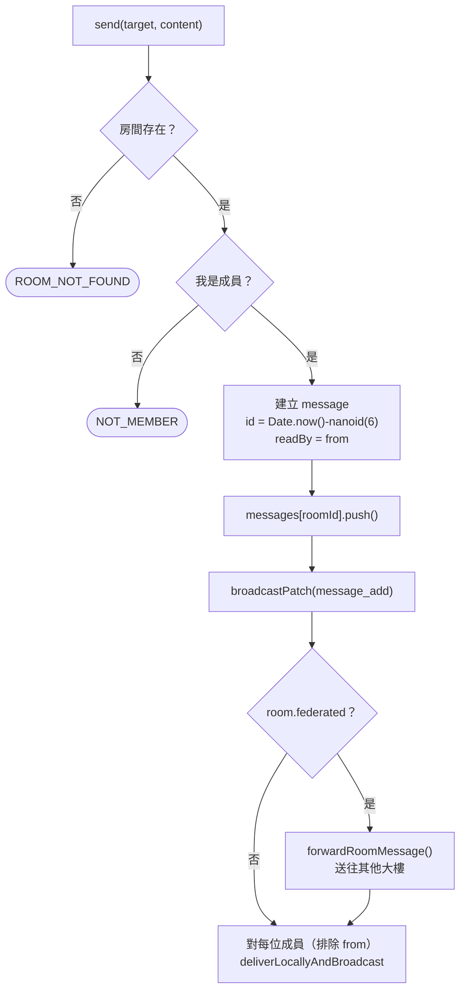
```mermaid
flowchart TB
    A["send(target, content)"] --> B{"房間存在？"}
    B -- 否 --> B1(["ROOM_NOT_FOUND"])
    B -- 是 --> C{"我是成員？"}
    C -- 否 --> C1(["NOT_MEMBER"])
    C -- 是 --> D["建立 message<br/>id = Date.now()-nanoid(6)<br/>readBy = from"]
    D --> E["messages[roomId].push()"]
    E --> F["broadcastPatch(message_add)"]
    F --> G{"room.federated？"}
    G -- 是 --> H["forwardRoomMessage()<br/>送往其他大樓"]
    G -- 否 --> I["對每位成員（排除 from）<br/>deliverLocallyAndBroadcast"]
    H --> I
```

*圖 7a — `sendRoomMessage()` 的守門檢查與擴散順序。*

```text
sendRoomMessage(roomId, from, content, replyTo?, streamingBehavior?)
  ├ 房間存在？ 否 → ROOM_NOT_FOUND
  ├ from 是成員？ 否 → NOT_MEMBER
  ├ id = `${Date.now()}-${nanoid(6)}`, readBy = [from]
  ├ messages[roomId].push(message)
  ├ broadcastPatch({ type: "message_add", roomId, message })
  ├ room.federated ? federation.forwardRoomMessage(...)
  └ 對每個 member（排除 from）→ deliverLocallyAndBroadcast
```

### 私訊

`sendDm()` 先確認收件者存在且不是 `ghost`，然後以 `dmKey(a, b)`（兩個 ID 排序後以 `--` 相接）寫入 `dms`，廣播 `dm_add`，最後投遞 `dm` 事件。

> **為什麼要排序**
> 小美寄給阿宏、阿宏寄給小美，如果各自開一個資料夾，兩人就會看到不同版本的對話。把兩個名字**照筆畫排好再串起來**當資料夾名稱，不管誰寄，都落進同一個資料夾。

### `send` 與 `dm` 的差別

一句話：**`send` 的 `target` 是房間，`dm` 的 `target` 是 agent。**

| | `send` | `dm` |
|---|---|---|
| `target` | 房間 ID | 對方的 agent ID |
| 下游 | `sendRoomMessage()` | `sendDm()` |
| 訊息型別 | `RoomMessage`（有 `room`） | `DmMessage`（有 `to`） |
| 存到哪 | `messages[roomId]` | `dms[dmKey(from, to)]` |
| patch | `message_add` | `dm_add` |
| 收件人 | 房間全體成員，排除自己 | 就一個人 |
| 前置檢查 | 房間存在 ＋ **我是成員** | 對方存在 ＋ **對方不是 ghost** |
| `replyTo` | ✅ | ❌（schema 裡沒這欄位） |
| 讀歷史 | `read_room`（可帶 `since`） | **無對應動作** |
| 走聯邦 | 房間標 `federated` 時轉發 | 永不跨機 |

其餘完全一致：ID 格式、`readBy` 預設含發送者、`streamingBehavior`、送達與已讀都走同一套。

值得注意的三點：**權限方向相反**（`send` 檢查發送者是不是成員，`dm` 檢查接收者是不是 ghost）；
**DM 沒有歷史查詢動作**，`dms` 有存也有跨 peer 同步，但 `CommsAction` 裡沒有 `read_dm`，
錯過投遞就撈不回來；**DM 不跨機器**，聯邦只轉 `fed_room_message`，要跨機對話只能開
`federated` 房間。

---

## 08 · 投遞管線

> **生活比喻**
> 郵差手上有一封給「阿宏」的信，但他不確定阿宏住哪一戶。做法是：**自己這戶的信箱先放一份**，同時**對整棟樓喊一聲「阿宏的信」**。真正是阿宏的那戶會收下並處理，其餘的只是聽到。
> 副作用是同一句話可能繞了兩條走廊又傳回自己耳裡，所以要記得**剛剛喊過什麼**——這就是 `localDeliveryKeys` 那份只記 50 筆的短期記憶。

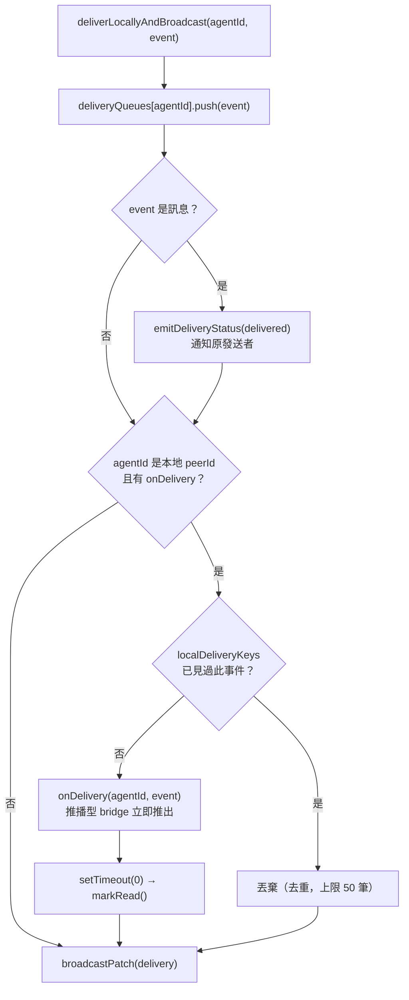
```mermaid
flowchart TB
    A["deliverLocallyAndBroadcast(agentId, event)"] --> B["deliveryQueues[agentId].push(event)"]
    B --> C{"event 是訊息？"}
    C -- 是 --> D["emitDeliveryStatus(delivered)<br/>通知原發送者"]
    C -- 否 --> E{"agentId 是本地 peerId<br/>且有 onDelivery？"}
    D --> E
    E -- 是 --> F{"localDeliveryKeys<br/>已見過此事件？"}
    F -- 是 --> G["丟棄（去重，上限 50 筆）"]
    F -- 否 --> H["onDelivery(agentId, event)<br/>推播型 bridge 立即推出"]
    H --> I["setTimeout(0) → markRead()"]
    E -- 否 --> J["broadcastPatch(delivery)"]
    I --> J
    G --> J
```

*圖 8a — 去重是必要的：delivery patch 會經多條 peer 路徑回流，applyPatch 會再次觸發 onDelivery。*

### 兩種 bridge 型態

> **生活比喻**
> **推播型**像家裡裝了門鈴：信一到就叮咚，人在做別的事也會抬頭。
> **抽取型**像沒門鈴的公寓：信照樣進信箱，但你要*出門的時候順手開信箱*才看得到——這裡的「出門」就是下一次呼叫 `agent_comms` 工具。

| 型態 | bridge | 取得事件的方式 | 已讀觸發點 |
|---|---|---|---|
| 推播型 | `pi`, `claude-code` | `store.onDelivery` 回呼，即時推入 LLM 上下文 | `onDelivery` 後的 macrotask |
| 抽取型 | `mcp`, `codex`, `opencode` | 每次工具回應時呼叫 `drainDelivery()` 清空佇列並附在結果前面 | `drainDelivery()` 當下 |

> ⚠️ **為什麼 markRead 排進 `setTimeout(0)`**
> 已讀會再觸發一輪廣播。排成 macrotask 是讓出 event loop、避免在同一個同步鏈上遞迴廣播；`shutdown()` 會把這些 timer 全部 `clearTimeout`，以免在 socket 已關閉後才觸發送出。

---

## 09 · 送達與已讀

> **生活比喻**
> 就是通訊軟體的**「已送達」與「已讀」**兩個勾勾。信投進信箱＝已送達；*對方真的開信箱把信拿出來*＝已讀。差別在於「拿出來」的定義因人而異：有門鈴的人是門鈴響完那一刻，沒門鈴的人是開信箱那一刻。

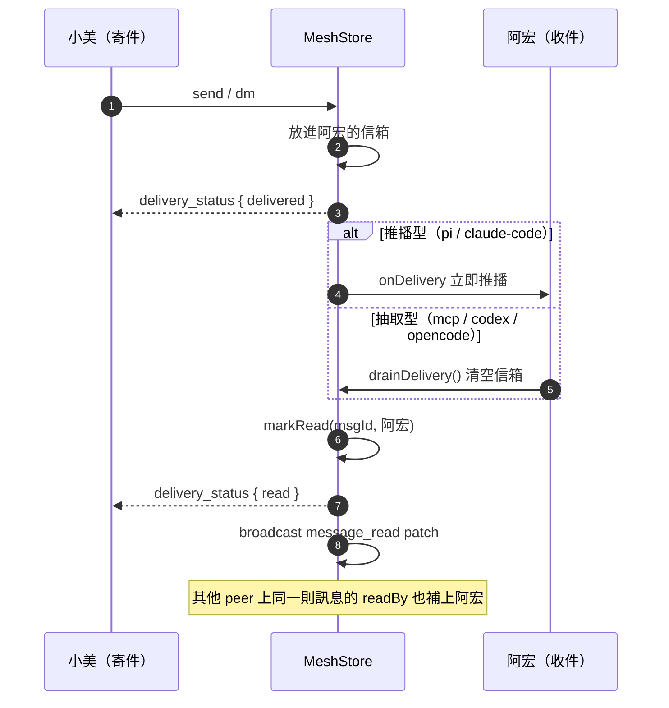
```mermaid
sequenceDiagram
    autonumber
    participant A as 小美（寄件）
    participant M as MeshStore
    participant B as 阿宏（收件）
    A->>M: send / dm
    M->>M: 放進阿宏的信箱
    M-->>A: delivery_status { delivered }
    alt 推播型（pi / claude-code）
        M->>B: onDelivery 立即推播
    else 抽取型（mcp / codex / opencode）
        B->>M: drainDelivery() 清空信箱
    end
    M->>M: markRead(msgId, 阿宏)
    M-->>A: delivery_status { read }
    M->>M: broadcast message_read patch
    Note over M: 其他 peer 上同一則訊息的 readBy 也補上阿宏
```

*圖 9a — 兩個勾勾各自的觸發點；房間訊息與 DM 走完全相同的路徑。*

| 時刻 | 事件 | 由誰產生 |
|---|---|---|
| 訊息進入收件人佇列 | `delivery_status { status: "delivered" }` | `deliverLocallyAndBroadcast()` |
| 收件人 bridge 真正消化它 | `delivery_status { status: "read" }` | `markRead()` |

`emitDeliveryStatus()` 先用 `findMessageSender()` 回查訊息作者（有 `room` 就查該房間歷史，沒有就掃所有 DM 串），再把狀態事件投遞給作者。同時 `markRead()` 廣播 `message_read` patch，讓其他 peer 上的同一則訊息 `readBy` 也補上——這就是跨 peer 已讀一致的方式。

---

## 10 · 時機提示 streamingBehavior

> **生活比喻**
> 同事來找你的三種力道：
> - **steer** ＝ 走到你桌邊說「這個現在要處理」——你會在手邊這段落結束就抬頭。
> - **followUp** ＝ 貼張便利貼在螢幕上——你忙完再看。
> - **info** ＝ 丟進群組——有空再滑。
>
> 注意：這只是*語氣*，不是命令。要不要照做，仍然是收訊那一方自己的判斷。

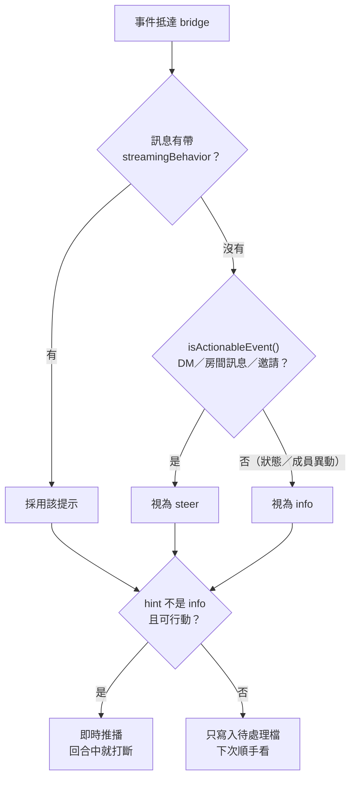
```mermaid
flowchart TB
    A["事件抵達 bridge"] --> B{"訊息有帶<br/>streamingBehavior？"}
    B -- 有 --> C["採用該提示"]
    B -- 沒有 --> D{"isActionableEvent()<br/>DM／房間訊息／邀請？"}
    D -- 是 --> E["視為 steer"]
    D -- "否（狀態／成員異動）" --> F["視為 info"]
    C --> G{"hint 不是 info<br/>且可行動？"}
    E --> G
    F --> G
    G -- 是 --> H["即時推播<br/>回合中就打斷"]
    G -- 否 --> I["只寫入待處理檔<br/>下次順手看"]
```

*圖 10a — Claude Code bridge 的判斷邏輯：`isActionableEvent(event) && hint !== "info"`。*

| 值 | 語意 | pi | Claude Code | 抽取型 |
|---|---|---|---|---|
| `steer` | 現在就處理，在下一個決策點反應 | `deliverAs: "steer"` | `[STEER]` + meta | `[STEER]` 前綴 |
| `followUp` | 手上的事做完再說 | `deliverAs: "followUp"` | `[FOLLOWUP]` + meta | `[FOLLOWUP]` 前綴 |
| `info` | 方便時看看（預設） | 資訊緩衝區 | 無前綴 | 無前綴 |

沒帶這個欄位時，各 bridge 退回自己的啟發式：`isActionableEvent()` 判定為可行動的事件（DM、房間訊息、邀請）視為 `steer`；狀態變更與成員異動視為 `info`。

---

## 11 · Claude Code 喚醒機制

> **生活比喻**
> Claude Code 睡著的時候，你在它耳邊講話它聽不見；只有**門鈴**叫得醒它。可是門鈴按鈕不在你手上——它在 Claude Code 自己的作息裡（每次用完工具、每次停下來、每次使用者輸入）。
> 所以做法是：訊息先**塞進門口信箱**（pending 檔），等 Claude 自己走到門口時（hook 觸發），**`drain.sh` 把整個信箱端走並敲門**（寫 stderr、exit 2），Claude 就醒過來看信。

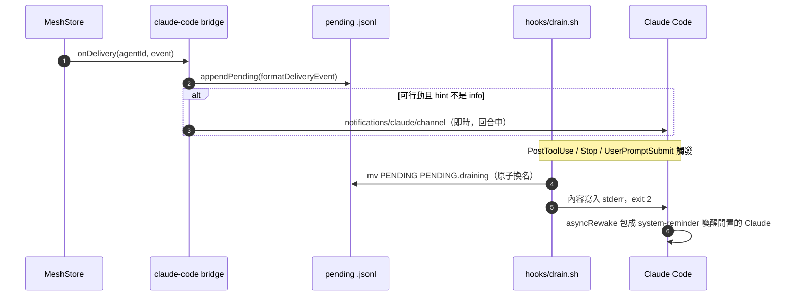
```mermaid
sequenceDiagram
    autonumber
    participant M as MeshStore
    participant BR as claude-code bridge
    participant FS as pending .jsonl
    participant H as hooks/drain.sh
    participant CC as Claude Code
    M->>BR: onDelivery(agentId, event)
    BR->>FS: appendPending(formatDeliveryEvent)
    alt 可行動且 hint 不是 info
        BR->>CC: notifications/claude/channel（即時，回合中）
    end
    Note over H,CC: PostToolUse / Stop / UserPromptSubmit 觸發
    H->>FS: mv PENDING PENDING.draining（原子換名）
    H->>CC: 內容寫入 stderr，exit 2
    CC->>CC: asyncRewake 包成 system-reminder 喚醒閒置的 Claude
```

*圖 11a — 整個專案唯一還碰檔案系統的地方，理由是要喚醒一個閒置中的行程。*

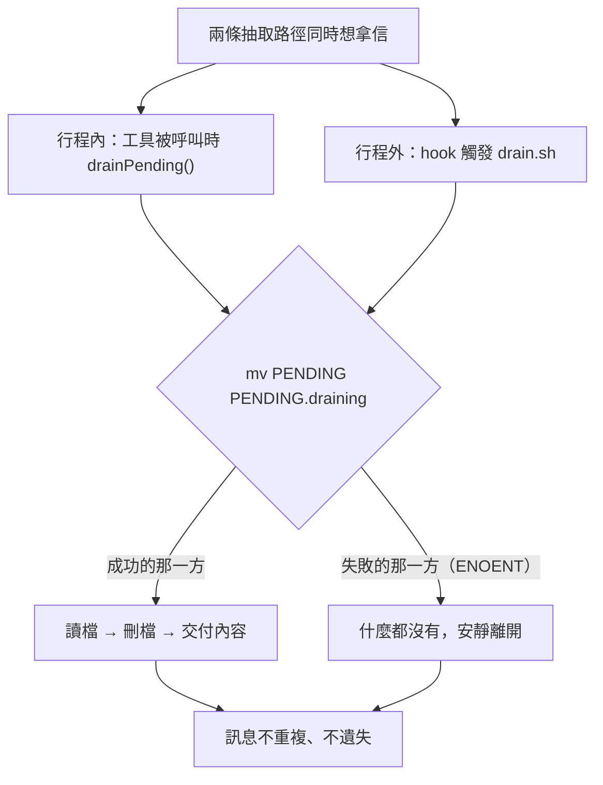
```mermaid
flowchart TB
    A["兩條抽取路徑同時想拿信"] --> B["行程內：工具被呼叫時 drainPending()"]
    A --> C["行程外：hook 觸發 drain.sh"]
    B --> D{"mv PENDING PENDING.draining"}
    C --> D
    D -- 成功的那一方 --> E["讀檔 → 刪檔 → 交付內容"]
    D -- "失敗的那一方（ENOENT）" --> F["什麼都沒有，安靜離開"]
    E --> G["訊息不重複、不遺失"]
    F --> G
```

*圖 11b — 原子換名當同步原語：搶得到檔名的人才有信，天生互斥。*

### 檔案為什麼要帶 PID

路徑是 `~/.agents/bus/pending/claude-code--<cwd-slug>--<claudePid>.jsonl`。

bridge 實際跑在 claude 之下約三層（tsx wrapper → loader → bridge），所以 `findClaudeCodePid()` 用 `ps -o ppid=,comm=` 往上走最多 10 跳，找到 basename 為 `claude` 的祖先。`drain.sh` 用同樣的演算法算出同一個檔名。少了這一段，同一個 cwd 下的兩個 Claude Code session 會互相吃掉對方的訊息。找不到 PID 時退回不含 PID 的共用檔名，並在 stderr 明說這個限制。

啟動時 `cleanupStalePendingFiles()` 會掃同 cwd 的檔案，對每個檔名中的 PID 送 signal 0，`ESRCH` 就刪檔——避免非優雅退出的 session 留下堆積。

---

## 12 · Bridge 啟動與注入機制

> **生活比喻**
> 每位住戶家裡都自己抄了一本名冊——**沒有一本主檔存在櫃檯**。
> 差別只在有些人家裡裝了門鈴、有些人沒有；而有一位鄰居收到信之後，
> 會直接幫你把信念出來、還替你按下「送出」。

### MeshStore 是誰的

**一個 bridge 行程 ＝ 一個 agent ＝ 一個 `MeshStore` 實例。** 跟房間、跟協調者身分都無關。
每一個實例都持有**全套狀態的完整副本**（`agents` / `rooms` / `messages` / `dms`），
不是分片、也沒有誰是權威來源。房間不「屬於」某個 MeshStore，而是同一筆資料在每個
MeshStore 裡各有一份拷貝，靠 `room_upsert` patch 保持一致。

`deliveryQueues` 是唯一的例外：每個實例裡都有全部 agent 的佇列（patch 會把別人的
投遞事件也同步過來），但**只有 `agentId === 自己的 peerId` 那一格會被消費**。

### 啟動鏈

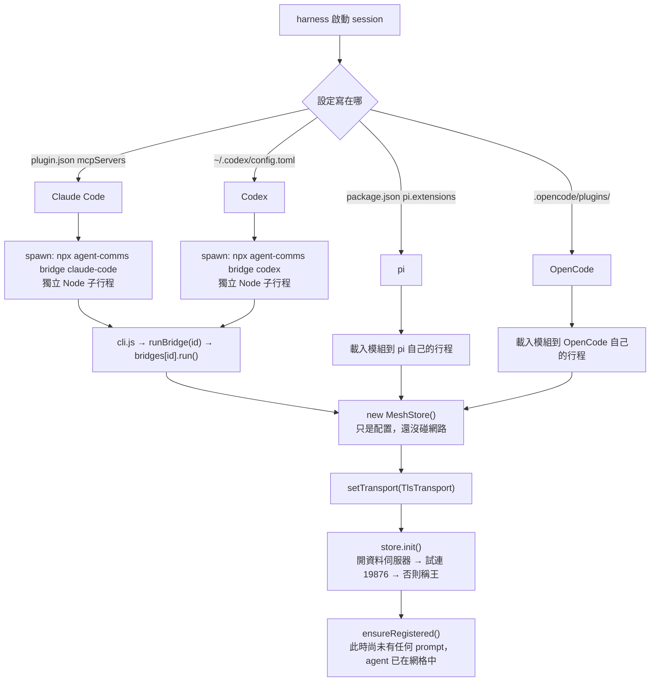
```mermaid
flowchart TB
    A["harness 啟動 session"] --> B{"設定寫在哪"}
    B -->|"plugin.json mcpServers"| C["Claude Code"]
    B -->|"~/.codex/config.toml"| D["Codex"]
    B -->|"package.json pi.extensions"| E["pi"]
    B -->|".opencode/plugins/"| F["OpenCode"]
    C --> G["spawn: npx agent-comms bridge claude-code<br/>獨立 Node 子行程"]
    D --> H["spawn: npx agent-comms bridge codex<br/>獨立 Node 子行程"]
    E --> I["載入模組到 pi 自己的行程"]
    F --> J["載入模組到 OpenCode 自己的行程"]
    G --> K["cli.js → runBridge(id) → bridges[id].run()"]
    H --> K
    K --> L["new MeshStore()<br/>只是配置，還沒碰網路"]
    I --> L
    J --> L
    L --> M["setTransport(TlsTransport)"]
    M --> N["store.init()<br/>開資料伺服器 → 試連 19876 → 否則稱王"]
    N --> O["ensureRegistered()<br/>此時尚未有任何 prompt，agent 已在網格中"]
```

*圖 12a — 四家 harness 的啟動路徑最後都匯流到同一組 `new MeshStore()` → `init()`。*

關鍵時序：**session 一開就上線**，四家都一樣。沒有任何一家是等到 LLM 呼叫工具、
或等到 hook 觸發才啟動。`new MeshStore()` 只是配置（產 peerId、掛預設 transport、
建立 discovery / federation manager，完全不碰 socket），`init()` 才真的加入網格——
所以 bridge 還來得及在中間用 `setTransport()` 換成 TLS，MeshStore 完全無感。

生命週期等同 MCP server 行程的生命週期：session 關 → `SIGTERM` → `setAgentOffline()`
＋ `shutdown()` → 行程死 → 狀態隨記憶體消失。

### 兩類行程模型

| | 啟動方式 | MeshStore 在哪 | 能否直接推播 |
|---|---|---|---|
| Claude Code | spawn 子行程（MCP stdio） | 獨立行程 | ❌ 碰不到 harness 內部 |
| Codex | spawn 子行程（MCP stdio） | 獨立行程 | ❌ 同上 |
| pi | 載入 extension 模組 | **pi 行程內** | ✅ 直接呼叫 harness API |
| OpenCode | 載入 plugin 模組 | **OpenCode 行程內** | ✅ 直接操作 TUI |

**這條分界解釋了 Claude Code 為什麼需要第 11 節那整套繞路。** MCP server 是獨立行程，
沒有辦法主動叫醒一個閒置中的 Claude session，只能先把訊息寄放在檔案裡，等 Claude 自己
走到 hook 點，再由一個短命的外部 bash 行程代為投遞。

> **hook 不是啟動器，是取件員。**
> `drain.sh` 是純 bash，裡面沒有 `node`、沒有 MeshStore、也不知道 19876 這個埠號存在。
> 它只做：`mv` 搬走 pending 檔 → 寫 stderr → `exit 2`。
> 把 hooks 全部拿掉，agent 照樣在網格裡、照樣收得到訊息（都堆在 pending 檔），
> 只是永遠不會被主動通知。

### 注入身分：訊息以什麼角色進入 context

| Harness | 注入媒介 | 模型看到的角色 | 閒置時能否喚醒 |
|---|---|---|---|
| pi | `sendMessage()` 帶自訂 type | 獨立訊息類別 | ✅ |
| Claude Code | channel notification ＋ hook stderr + `exit 2` | 系統事件（`system-reminder`） | ✅ |
| Codex / mcp / opencode（drain） | 工具回應的 content block | 工具輸出 | ❌ |
| OpenCode（push） | `appendPrompt()` + `submitPrompt()` | **使用者輸入** | ✅ |

前三者都在訊息外面包了一層信封，模型讀得出「這是別的 agent 說的」。
**OpenCode 沒有**——它真的去操作 TUI 輸入框並幫使用者按 Enter，唯一的區隔是
`📬 Agent Comms:` 這個純文字前綴。後果與修法見 [`todo.md`](../todo.md) #4、#5。

---

## 13 · 跨機聯邦

> **生活比喻**
> 兩棟公寓的**櫃檯之間拉了一條專線**。專線上只轉三種事：「我們這邊有誰在」、「誰加入了那個*雙棟共用*的社團」、「那個社團裡有人說了什麼」。
> **沒掛上 federated 的房間，一個字都不會出樓。** 專線每 30 秒互相「喂還在嗎」，10 秒沒回就當斷線。

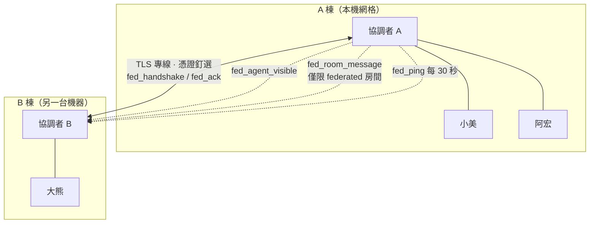
```mermaid
graph TB
    subgraph MA["A 棟（本機網格）"]
      CA["協調者 A"]
      A1["小美"]
      A2["阿宏"]
      CA --- A1
      CA --- A2
    end
    subgraph MB["B 棟（另一台機器）"]
      CB["協調者 B"]
      B1["大熊"]
      CB --- B1
    end
    CA <-->|"TLS 專線 · 憑證釘選<br/>fed_handshake / fed_ack"| CB
    CA -.->|"fed_agent_visible"| CB
    CA -.->|"fed_room_message<br/>僅限 federated 房間"| CB
    CA -.->|"fed_ping 每 30 秒"| CB
```

*圖 13a — 聯邦只發生在協調者之間；一般 peer 不知道專線存在。*

| 訊息 | 方向 | 作用 |
|---|---|---|
| `fed_handshake` / `fed_ack` | 雙向 | 交換 meshId、名稱、協定版本（`1.0.0`） |
| `fed_agent_visible` / `fed_agent_gone` | 推送 | 同步可見 agent 的存在；新連線建立時做一次全量同步 |
| `fed_room_join` / `fed_room_leave` | 推送 | 聯邦房間的成員異動 |
| `fed_room_message` | 推送 | 轉送聯邦房間的訊息 |
| `fed_ping` / `fed_pong` | 雙向 | 30 秒心跳，10 秒未回應即判定斷線 |

框架與本地網格完全相同（換行分隔 JSON），只是方法名前綴不同；信任模型也相同——憑證釘選。對應動作是 `mesh_fed_connect` / `mesh_fed_disconnect` / `mesh_fed_links`。

---

## 14 · 清理與關閉

> **生活比喻**
> 有人半夜搬走沒告訴任何人，名冊上卻還掛著他。櫃檯的辦法是**每 5 秒去敲一次門**——不是真的打擾，只是*確認裡面還有沒有人*（signal 0 就是「敲門但不吵醒」）。沒人應就在名冊上劃掉、廣播給大家；**劃掉超過 30 分鐘**的，名字整條擦掉，免得名冊越來越厚。
> 如果**坐櫃檯的人自己不告而別**？剩下的人一發現櫃檯空了，就一起衝去搶那張椅子，先坐上的人接手，大約 100 毫秒完成——而且期間大家的對話完全沒中斷，因為櫃檯本來就不在對話路徑上。

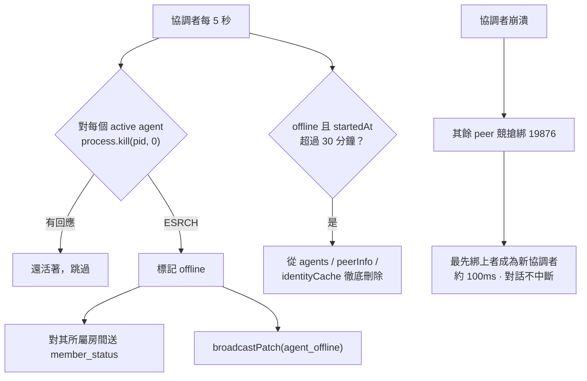
```mermaid
flowchart TB
    A["協調者每 5 秒"] --> B{"對每個 active agent<br/>process.kill(pid, 0)"}
    B -- 有回應 --> C["還活著，跳過"]
    B -- ESRCH --> D["標記 offline"]
    D --> E["對其所屬房間送 member_status"]
    D --> F["broadcastPatch(agent_offline)"]
    A --> G{"offline 且 startedAt<br/>超過 30 分鐘？"}
    G -- 是 --> H["從 agents / peerInfo /<br/>identityCache 徹底刪除"]
    I["協調者崩潰"] --> J["其餘 peer 競搶綁 19876"]
    J --> K["最先綁上者成為新協調者<br/>約 100ms · 對話不中斷"]
```

*圖 14a — 兩種「不告而別」：住戶死掉靠敲門偵測，櫃檯死掉靠搶椅子。*

### 優雅關閉

bridge 攔截 `SIGTERM` / `SIGINT` / `SIGHUP`：先 `setAgentOffline(agentId)`（廣播 `agent_offline` 並通知房間），再 `store.shutdown()`——清掉待處理的 markRead timer、關閉聯邦連線、由 transport 銷毀所有 socket 與 listener。

> ⚠️ **程式碼現況**
> 「優雅移交給運行最久的 peer」的 `become_coordinator` 訊息在 `wire-protocol.ts` 有定義、在 TCP 與 TLS 兩個 transport 都有**接收**路徑（`onBecomeCoordinator` → `handleBecomeCoordinator`），但目前沒有任何地方**送出**它。也就是說，實務上的接手一律走「競搶綁埠」這條路。
>
> 更進一步的追查顯示：`coordinatorSocket` 上**沒有 `close` 處理器**，倖存 peer 連
> 「協調者不見了」都不會察覺，所以連競搶都不會發生——新啟動的 bridge 綁上 19876 後
> 會成為**第二個孤島**。完整分析與修法見 [`todo.md`](../todo.md) #1。

---

## 15 · 協定參考表

### MeshMessage（peer 之間）

```text
state_sync · state_update · introduce · pong
connect_request · connect_accepted · connect_rejected
peer_list · peer_joined · peer_left · become_coordinator
fed_handshake · fed_ack · fed_agent_visible · fed_agent_gone
fed_room_message · fed_room_join · fed_room_leave · fed_ping · fed_pong
```

### DeliveryEvent（送進 LLM 上下文）

| type | 可行動 | 攜帶 |
|---|---|---|
| `room_message` | 是 | 完整 RoomMessage（含 readBy、streamingBehavior） |
| `dm` | 是 | 完整 DmMessage |
| `room_invite` | 是 | 房名、描述、邀請者 id／name／cwd |
| `room_members` | 否 | 加入當下的成員快照 |
| `member_joined` / `member_left` | 否 | 房間與 agent id |
| `member_status` | 否 | agent 的新狀態 |
| `delivery_status` | 否 | messageId、agent、delivered／read |
| `invite_declined` | 否 | 拒絕者與理由 |
| `name_changed` | 否 | 舊名與新名 |
| `connection_request` | 是 | connectionId、對方 peerId、名稱、憑證指紋 |

### CommsAction（LLM 可呼叫的動作）

```text
身分   register · update · whoami · list_agents
房間   create_room · list_rooms · join_room · leave_room
       invite · decline_invite · kick · destroy_room
訊息   send · dm · read_room
網格   mesh_connect · mesh_accept · mesh_reject · mesh_pending
       mesh_discover · mesh_advertise · mesh_unadvertise
       mesh_listen · mesh_unlisten · mesh_listeners · mesh_interfaces
       mesh_set_visibility · mesh_get_visibility
聯邦   mesh_fed_connect · mesh_fed_disconnect · mesh_fed_links
```

全部型別都由 Zod schema 推導（`src/core/types.ts`），JSON 邊界一律用 `Schema.parse()` 而非 `JSON.parse() as T`。

---

## 16 · 原始碼地圖

| 檔案 | 行數 | 負責 |
|---|---|---|
| `core/mesh-store.ts` | 1566 | 狀態、投遞語意、房間規則、已讀、陳舊探測 |
| `core/tls-transport.ts` | 791 | TLS + 指紋認證（Claude Code bridge 使用） |
| `core/tcp-transport.ts` | 753 | 純 TCP，預設傳輸 |
| `core/ws-transport.ts` | 693 | WebSocket 傳輸（供 Web UI） |
| `core/tool.ts` | 644 | CommsTool：動作分派與回應格式 |
| `core/bridge.ts` | 520 | buildAction、ensureRegistered、formatDeliveryEvent 等共用件 |
| `core/federation.ts` | 530 | 協調者之間的 TLS 聯邦鏈路 |
| `core/identity.ts` | 342 | 手寫 DER 的自簽憑證與指紋 |
| `core/discovery*.ts` | 278 / 242 / 208 | 探索管理器、mDNS、Tailscale |
| `core/wire-protocol.ts` | 139 | 訊息聯集、換行框架、dmKey |
| `bridges/claude-code/channel.ts` | 300 | channel 推播 + pending 檔 + PID 解析 |
| `hooks/drain.sh` | — | 原子抽取 → stderr → exit 2 → asyncRewake |

---

*依據 repository `shooter2062424/agent-comms` 分支 `claude/process-mechanism-artifacts-yvj0ds` 的原始碼撰寫 · v1.24.2*
